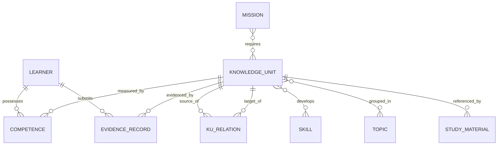

# ENGINEERINGOS_SPECIFICATION
## The Constitutional Document

**Version:** 3.1.0
**Status:** Constitutional — All implementations derive from this document
**Date:** 2026-07-19
**Supersedes:** MASTER_SHARED_MEMORY v1.0, v1.1, v2.0; ENGINEERINGOS_SPECIFICATION v3.0.0 (truncated)

---

> *"This is not a Learning Management System.*
> *This is not an AI Tutor.*
> *This is not a Knowledge Base.*
> *This is an Operating System for Knowledge Engineering."*
> — EngineeringOS Founding Specification

---

## Preâmbulo

Toda grande civilização técnica repousa sobre uma camada de especificação que precede a implementação.
TCP/IP precede a internet. SQL precede todo banco de dados. POSIX precede todo sistema operacional.

EngineeringOS é a camada de especificação da Engenharia de Conhecimento.

Tudo o que segue — cada componente, cada algoritmo, cada construção da DSL, cada schema — deriva deste documento. Quando a implementação conflitar com esta especificação, a especificação vence. Quando a especificação estiver errada, um RFC Constitucional a emenda. Nada mais tem essa autoridade.

---

# Parte 0 — Identidade e Posicionamento

## 0.1 O que EngineeringOS É

EngineeringOS é um **sistema operacional para engenharia de conhecimento**: uma infraestrutura formal que representa conhecimento como grafo versionado, mede competência a partir de evidências verificáveis, e agenda o aprendizado sob restrições cognitivas explícitas.

Três teses fundadoras:

1. **Currículo é código.** Conhecimento é declarado numa DSL textual (`.eos`), versionada em Git, compilada para um grafo validado. Currículos recebem diff, review, merge e release — como software.
2. **Competência é evidência, não quiz.** O estado de maestria de um agente deriva da agregação probabilística de registros de evidência (artefatos, soluções, explicações, decisões, benchmarks) com proveniência e revisão — não de pontuação de múltipla escolha.
3. **Cognição é restrição de arquitetura.** Limites da memória de trabalho (Cowan) e carga cognitiva (Sweller) são *hard constraints* do agendador, não sugestões de UX.

## 0.2 O que EngineeringOS Não É

- **Não é um LMS.** Não gerencia turmas, notas, frequência ou matrículas.
- **Não é um tutor de IA.** LLMs são *fontes de evidência de baixo peso* (w = 0.40), nunca autoridade epistêmica.
- **Não é uma base de conhecimento.** Não armazena conteúdo como fim; armazena *estrutura* (relações, pré-requisitos, provas de competência). Conteúdo é referenciado via `StudyMaterial`.
- **Não é uma plataforma de gamificação.** Progresso exibido deriva do modelo matemático, nunca de mecânicas de engajamento desacopladas de aprendizado real.

## 0.3 A Metáfora do Sistema Operacional

| Conceito de SO | Equivalente EngineeringOS |
|---|---|
| Kernel | Knowledge Engine (lifecycle das KUs) |
| Processos | Missões (Missions) em execução |
| Scheduler | ULA — Universal Learning Architecture |
| Memória | UKG — Universal Knowledge Graph |
| Syscalls | API REST (`/api/*`) |
| Drivers | Parsers de seed (`.eos`) e conectores de evidência |
| Usuários | Learners (humanos ou agentes) |
| Permissões | Pesos de fonte e status de evidência |

## 0.4 Princípios (P1–P8)

- **P1 — Specification First.** Nenhum componente existe sem definição prévia neste documento.
- **P2 — Evidência sobre autodeclaração.** Nenhuma maestria muda sem um `EvidenceRecord`.
- **P3 — Grafo acíclico ou nada.** Dependência cíclica de pré-requisitos é erro fatal de compilação (paradoxo).
- **P4 — Restrição cognitiva é lei.** O sistema jamais apresenta mais de `WORKING_MEMORY_CAPACITY` (= 4) KUs inéditas simultaneamente.
- **P5 — Conhecimento decai.** Todo estado de competência tem fator de decaimento; maestria efetiva é função do tempo.
- **P6 — Proveniência total.** Toda KU e toda evidência carregam fonte, versão e trilha de auditoria.
- **P7 — IA é colaboradora subordinada.** Saída de IA tem peso de fonte fixo e inferior a padrões e consenso de especialistas.
- **P8 — Falsificabilidade.** Toda fórmula desta especificação é hipótese experimental sujeita à Parte X (Validação).

---

# Parte I — META-MODELO

## 1.1 Visão Geral

O meta-modelo define **o que pode existir** no universo EngineeringOS. Sete entidades primárias, duas entidades de suporte, e um catálogo fechado de relações.

## 1.2 Catálogo de Entidades

| Entidade | Identidade | Descrição |
|---|---|---|
| `KnowledgeUnit` (KU) | URI `ku:<domain>:<concept>:v<N>` ou id textual | Menor unidade indivisível de conhecimento com definição formal |
| `Learner` | UUID | Agente (humano ou IA) cujo estado de competência é rastreado |
| `Competence` | (learner_id, ku_id) | Estado de maestria de um Learner sobre uma KU |
| `EvidenceRecord` | UUID | Prova datada e revisada de competência |
| `Mission` | id textual | Objetivo terminal: conjunto de KUs requeridas com thresholds |
| `Skill` | `skill:<domain>:<verb>` | Capacidade operacional ligada a N KUs |
| `Topic` | id textual | Agrupamento temático de KUs (navegação, não dependência) |
| `Assessment` | UUID | Registro de desafio respondido (CCE) |
| `StudyMaterial` | UUID | Recurso externo (vídeo, PDF, artigo, link) ligado a uma KU |

## 1.3 Catálogo de Relações

| Relação | Domínio → Contradomínio | Semântica | Peso de transferência |
|---|---|---|---|
| `prerequisite` | KU → KU | source deve ser dominada antes de target | 1.0 |
| `extends` / `extended_by` | KU → KU | target aprofunda source | 0.7 |
| `applies_to` | KU → KU | source é instrumental para target | 0.4 |
| `contradicts` | KU ↔ KU | conteúdos mutuamente excludentes (flag de revisão) | — |
| `equivalent` | KU ↔ KU | mesma competência sob formulações distintas | — |
| `requires` | Mission → KU | pertencimento ao conjunto terminal | — |
| `evidences` | EvidenceRecord → KU | prova incide sobre a KU | — |
| `develops` | KU → Skill | dominar a KU desenvolve a Skill | — |

## 1.4 Cardinalidade e Restrições

- Toda KU tem 0..N pré-requisitos; o grafo induzido por `prerequisite` **deve ser um DAG** (P3).
- `Competence` é chave composta (learner, ku): existe no máximo um estado por par.
- `EvidenceRecord` referencia exatamente um Learner e uma KU; N evidências por par são esperadas.
- `Mission.critical_kus ⊆ Mission.required_kus`.
- Deleção de KU cascateia relações, competências e evidências (integridade referencial).

## 1.5 Diagrama do Meta-Modelo



---

# Parte II — KNOWLEDGE ENGINE

## 2.1 Propósito e Posição

O Knowledge Engine é o kernel: governa o ciclo de vida de cada KU do nascimento ao arquivamento. Nenhum outro componente cria ou destrói conhecimento.

## 2.2 As Oito Perguntas

Todo conhecimento no sistema deve poder responder:

1. **O que é?** (definição formal)
2. **De onde veio?** (proveniência e fontes)
3. **Do que depende?** (pré-requisitos)
4. **O que habilita?** (dependentes e skills)
5. **Quão bem foi verificado?** (status: draft → review → validated)
6. **Quem o domina, e quanto?** (estados de competência)
7. **Quando envelhece?** (taxa de decaimento do domínio)
8. **Quando morre?** (deprecação e substituição versionada)

## 2.3 Ciclo de Vida

```
draft ──review──▶ validated ──superseded──▶ deprecated ──▶ archived
  ▲                    │
  └────rejected────────┘
```

## 2.4 Nascimento (Knowledge Birth)
Uma KU nasce **exclusivamente** por compilação de um arquivo `.eos` (Parte VI) ou por RFC aprovado. Nasce em `draft`, com `element_interactivity` estimado e proveniência obrigatória.

## 2.5 Evolução
Alterações de conteúdo geram nova versão (`v1 → v2`) e relação `equivalent` ou `extends` para a anterior. Versões antigas nunca são editadas in-place.

## 2.6 Medição
A medição de conhecimento é indireta: mede-se **competência de agentes** (Parte III) e infere-se qualidade da KU pela distribuição de evidências sobre ela.

## 2.7 Conexão
Novas relações exigem validação anti-ciclo (Definição 5) antes do commit.

## 2.8 Envelhecimento
Cada domínio define `domain_decay_rate` λ (default 0.05). Ver Definição 9.

## 2.9 Desaparecimento
KU deprecada permanece consultável; deixa de ser agendável pela ULA e suas competências congelam.

## 2.10 Revisão
Evidências com `status = contested` disparam fila de revisão humana. Três contestações independentes rebaixam a KU para `review`.

## 2.11 Conhecimento → Competência
O elo é o `EvidenceRecord`: conhecimento sem evidência é biblioteca; evidência sem conhecimento estruturado é anedota. EngineeringOS exige os dois.

---

# Parte III — MATEMÁTICA FORMAL

*Todas as definições abaixo estão implementadas em `impl/src/cognitive_engine.py` e cobertas por `test_suite.py`.*

## 3.1 Espaços Formais

- **𝕂** — espaço de conhecimento: DAG `G = (V, E)` onde `V` são KUs e `E ⊆ V×V` são relações `prerequisite`.
- **𝕄** — espaço de maestria: função `m: Learner × V → [0,1]`.
- **𝔼** — espaço de evidências: sequências datadas `(E₁, …, Eₙ)` por par (learner, KU).

**Definição 1 (Confiança de evidência).**
```
conf(E) = source_weight(E) · reviewer_agreement(E) · recency_factor(E)
```
com `source_weight ∈ {0.90 padrão internacional, 0.80 consenso de especialistas, 0.60 benchmark reprodutível, 0.40 saída de IA}`.

**Definição 2 (Agregação noisy-OR).**
```
conf_agg(E₁…Eₙ) = 1 − ∏ᵢ (1 − conf(Eᵢ))
```
Propriedades: monotônica, comutativa, limitada em [0,1); nenhuma evidência isolada garante maestria total.

## 3.2 Funções de Aprendizado

**Definição 3 (Delta de aprendizado).**
```
Δm = η_eff · (conf_agg − m_atual) · prereq_factor
```
onde `η_eff` é a taxa de aprendizado efetiva e `prereq_factor ∈ [0,1]` penaliza aprendizado sobre base frágil (média das maestrias dos pré-requisitos diretos).

**Definição 4 (Fronteira de Conhecimento).**
```
F(a,t) = { v ∈ V | m(a,v) < θ  ∧  ∀u ∈ pred(v): m(a,u) ≥ θ }
```
com threshold constitucional `θ = 0.85`. A fronteira é o único conjunto agendável.

## 3.3 Funções de Competência

**Definição 4.1 (Maestria efetiva).**
```
m_eff(a,v,t) = m(a,v) · decay(v, t − t_última_evidência)
```

## 3.4 Validação Estrutural

**Definição 5 (Aciclicidade).** Para toda edição de `E`: se `find_cycle(G) ≠ ∅`, a compilação falha com `CyclicDependencyError` ("paradoxo"). Não há downgrade para warning.

## 3.5 Distância de Conhecimento

**Definição 6 (Similaridade de Jaccard ancestral).**
```
sim_K(a,b) = |anc*(a) ∩ anc*(b)| / |anc*(a) ∪ anc*(b)|,   anc*(x) = ancestors(x) ∪ {x}
```

## 3.6 Métricas Adaptativas do Grafo

- **Profundidade** de v: caminho máximo desde raízes (usada no layout e na estimativa de custo).
- **Interatividade de elementos** `EI(v) ∈ [1,10]`: proxy de carga intrínseca (Sweller).

## 3.7 Funções de Transferência

**Definição 7 (Coeficiente de transferência).**
```
τ(a→b) = sim_K(a,b) · relevance(rel(a,b))
relevance: prerequisite=1.0, extends/extended_by=0.7, applies_to=0.4, none=0.1
```

**Definição 8 (Novidade).** `novelty(v) = max(0, 1 − max_{u dominado} τ(u→v))`

## 3.8 Otimização de Missão

**Definição 9 (Decaimento).** `decay(v, Δt) = e^(−λ_domínio · Δt)` com Δt em dias.

**Definição 10 (Custo de agendamento).**
```
cost(v) = α·EI(v) + β·(EI(v)·novelty(v)) − γ·E[conf]
```
com pesos por missão `(α, β, γ)` default `(0.4, 0.3, 0.3)` e `E[conf] = 0.6`.

**Definição 11 (Trajetória ótima π\*).** Agendador guloso sobre a fronteira: a cada passo escolhe `argmin cost(v)` entre candidatos com pré-requisitos satisfeitos, respeitando `|π*| ≤ WORKING_MEMORY_CAPACITY` por sessão. Fallback: ordenação topológica do subgrafo restante.

**Definição 12 (Satisfação de missão).**
```
satisfied(M,a) ⟺ ∀v ∈ required(M): m_eff(a,v) ≥ θ_M  ∧  ∀v ∈ critical(M): m_eff(a,v) ≥ θ_crit
```
com `θ_M = 0.85` e `θ_crit = 0.90` por default.

---

# Parte IV — ONTOLOGIA FORMAL

## 4.1 Hierarquia de Topo

```
Entity
├── EpistemicEntity        (KnowledgeUnit, Topic)
├── AgentiveEntity         (Learner, Reviewer)
├── DeonticEntity          (Mission, Project, Assessment)
└── ProbativeEntity        (EvidenceRecord, StudyMaterial)
```

## 4.2 Definições de Entidade
Cada entidade da Parte I é instância de exatamente uma classe acima. KUs são epistêmicas (descrevem o mundo); Missões são deônticas (prescrevem obrigações); Evidências são probativas (sustentam crenças sobre agentes).

## 4.3 Taxonomia de Relações
Relações epistêmicas (`prerequisite`, `extends`, `contradicts`, `equivalent`) só conectam entidades epistêmicas. Relações probativas (`evidences`) conectam probativas a epistêmicas via um agente.

## 4.4 Axiomas Ontológicos

- **A1:** `prerequisite` é irreflexiva, antissimétrica e acíclica (fecho transitivo é ordem parcial estrita).
- **A2:** `equivalent` é relação de equivalência dentro de uma mesma versão de domínio.
- **A3:** Nenhuma entidade deôntica altera estado epistêmico; missões leem o grafo, nunca o escrevem.
- **A4:** Todo estado de competência é derivável por replay da sequência de evidências (event sourcing lógico).

---

# Parte V — MODELO COGNITIVO

## 5.1 Arquitetura Cognitiva
O modelo assume um aprendiz com memória de trabalho limitada, memória de longo prazo associativa, e esquecimento exponencial — o mínimo denominador entre humanos e a maioria dos agentes com contexto limitado.

## 5.2 As Sete Camadas

1. **Sensorial** — apresentação de material (StudyMaterial)
2. **Atenção** — seleção da fronteira F(a,t)
3. **Memória de trabalho** — *hard limit* de 4 chunks (Cowan, 2001)
4. **Codificação** — resolução de desafios (CCE)
5. **Consolidação** — evidência validada → Δm
6. **Recuperação** — reassessment espaçado
7. **Transferência** — propagação τ entre KUs vizinhas

## 5.3 Restrições Cognitivas sobre a Implementação

- `WORKING_MEMORY_CAPACITY = 4` é constante constitucional (`cognitive_engine.WORKING_MEMORY_CAPACITY`), consumida pela ULA e pelo CCE. Alterá-la exige RFC.
- `element_interactivity` alto + `novelty` alta ⟹ custo proibitivo: o agendador naturalmente adia KUs de carga composta (Definição 10).
- Sessões de estudo nunca misturam mais de um domínio novo simultaneamente quando `EI ≥ 7` (recomendação R1, não bloqueante).

---

# Parte VI — ESPECIFICAÇÃO DA DSL (.eos)

## 6.1 Filosofia de Design
A DSL `.eos` é para currículo o que Terraform é para infraestrutura: declarativa, legível por humanos, versionável, e compilada com validação estrutural total (incl. anti-ciclo) **antes** de tocar o banco.

## 6.2 Gramática (EBNF)

```ebnf
file         = { declaration } ;
declaration  = directive | entity_decl ;
directive    = "@" IDENT value ;
entity_decl  = knowledge_decl | evidence_decl | generic_decl ;

knowledge_decl = "knowledge" IDENT [ level ] [ ":" ] block ;
level          = "foundational" | "intermediate" | "advanced" | "expert" ;

evidence_decl  = "evidence" IDENT "for" IDENT [ ":" ] block ;

generic_decl   = kind IDENT [ ":" ] block ;
kind           = "competence" | "mission" | "assessment" | "skill"
               | "project" | "agent" | "topic" ;

block        = "{" { pair } "}" ;
pair         = IDENT ":" value [ "," ] ;
value        = STRING | NUMBER | VERSION | IDENT [ block ] | list | block ;
list         = "[" [ value { "," value } ] "]" ;

STRING       = '"' … '"' ;          NUMBER  = ["-"] digits ["." digits] ;
VERSION      = digits "." digits "." digits ;
IDENT        = letter { letter | digit | "_" | "." | "-" } ;
comment      = ("--" | "#") … EOL ;
```

O formato de seed abreviado (`module` / `ku` / `@prerequisite` / `@content`) usado em `impl/seeds/*.eos` é açúcar sintático compilado para `knowledge_decl` equivalentes.

## 6.3 Tipos Primitivos
`string`, `number` (int/float), `version` (semver), `ident`, `list`, `block`.

## 6.4 Declarações de Entidade
Palavras-chave reconhecidas: `KNOWLEDGE`, `COMPETENCE`, `MISSION`, `ASSESSMENT`, `EVIDENCE`, `SKILL`, `PROJECT`, `AGENT`, `TOPIC` (case-insensitive no compilador de referência).

## 6.5 Alvos de Compilação
1. **AST JSON** (saída canônica do parser)
2. **Relacional** (SQLAlchemy → SQLite/PostgreSQL)
3. **Grafo em memória** (NetworkX DiGraph, para o motor cognitivo)

A compilação executa **dry-run anti-ciclo obrigatório**: qualquer ciclo em `requires`/`prerequisite` aborta com `FALHA FATAL NA AST: Paradoxo detectado`.

## 6.6 Exemplo Completo

```eos
@version 1.0.0
@domain "linear_algebra"

knowledge Vetores foundational: {
  title: "Vetores no plano e no espaço",
  definition: "Representação geométrica e algébrica; produto escalar e vetorial.",
  element_interactivity: 4
}

knowledge Matrizes intermediate: {
  title: "Matrizes e operações",
  definition: "Produto matricial, inversa, fatoração LU.",
  requires: [Vetores],
  element_interactivity: 6
}

mission dominar_algebra: {
  label: "Dominar Álgebra Linear",
  required_kus: [Vetores, Matrizes],
  terminal_threshold: 0.85,
  cost_weights: { alpha: 0.4, beta: 0.3, gamma: 0.3 }
}

evidence ev_prova1 for Matrizes: {
  type: solution,
  source_weight: 0.8,
  reviewer_agreement: 1.0
}
```

---

# Parte VII — ARQUITETURA DE COMPONENTES

| Componente | Sigla | Responsabilidade | Implementação |
|---|---|---|---|
| Knowledge Core | TAKC | Persistência do meta-modelo | `models.py`, `database.py`, Alembic |
| Unified Curriculum & Evidence Format | UCEF | DSL `.eos` + compilador | `eos_parser.py` |
| Universal Learning Architecture | ULA | Agendador de trajetórias π* | `cognitive_engine.optimize_learning_trajectory` |
| Universal Knowledge Graph | UKG | DAG + métricas (Jaccard, τ, fronteira) | `cognitive_engine` + NetworkX |
| Cognitive Challenge Engine | CCE | Geração de desafios sob limite de WM | `cce.py` |
| Distributed Cognitive State Tracker | DCST | Estados de competência + decaimento | `models.Competence` + workers |
| Knowledge Engine | KE | Lifecycle das KUs (Parte II) | `api.py` + `curriculum_seed.py` |
| EngineeringOS Core | CORE | API REST, auth, telemetria, tasks | `main.py`, `api.py`, `celery_worker.py`, `telemetry.py` |

Processamento pesado (recálculo de matrizes de transferência, otimização de trajetória) roda **desacoplado do event loop** via Celery; a API responde `202 {task_id}` e o cliente faz polling em `/tasks/{id}`.

---

# Parte VIII — SCHEMAS

## 8.1 Knowledge Unit
```json
{
  "id": "ku:linear_algebra:matrix_multiplication:v1",
  "title": "string", "domain": "string", "concept": "string",
  "level": "foundational|intermediate|advanced|expert",
  "definition": "string(≤1000)",
  "element_interactivity": 4,
  "domain_decay_rate": 0.05,
  "version": "1.0.0",
  "status": "draft|review|validated|deprecated",
  "provenance": {}, "sources": []
}
```

## 8.2 Evidence Record
```json
{
  "id": "uuid", "learner_id": "uuid", "ku_id": "string",
  "type": "artifact|explanation|solution|decision|benchmark",
  "artifact_hash": "sha256|null",
  "reviewers": [{ "reviewer_id": "string", "reviewer_type": "human|ai", "verdict": "accept|reject" }],
  "source_weight": 0.4, "reviewer_agreement": 1.0, "recency_factor": 1.0,
  "confidence": 0.4,
  "status": "pending|validated|contested|rejected"
}
```

## 8.3 Mission
```json
{
  "id": "string", "label": "string", "version": "1.0.0",
  "status": "draft|active|archived",
  "required_kus": [], "optional_kus": [], "critical_kus": [],
  "terminal_threshold": 0.85, "critical_threshold": 0.90,
  "cost_weights": { "alpha": 0.4, "beta": 0.3, "gamma": 0.3 }
}
```

## 8.4 Competence State
```json
{
  "learner_id": "uuid", "ku_id": "string",
  "mastery_score": 0.0, "confidence": 0.0,
  "decay_factor": 1.0, "effective_mastery": 0.0,
  "last_updated": "ISO-8601"
}
```

---

# Parte IX — GOVERNANÇA

## 9.1 Processo de RFC
1. Abrir RFC em `META/rfcs/NNNN-titulo.md` com: motivação, mudança proposta, impacto nas Definições 1–12, plano de migração.
2. Período de revisão mínimo: 7 dias.
3. Aprovação exige demonstração de que nenhum axioma (A1–A4) nem princípio (P1–P8) é violado — ou emenda explícita a eles.
4. Merge do RFC ⟹ bump de versão desta especificação (semver: emendas de princípio = major).

## 9.2 Interface de Contribuição
Currículos (`.eos`) seguem fluxo de PR comum: o CI compila o seed, roda o dry-run anti-ciclo e o test_suite. Currículo que não compila não entra.

## 9.3 Estrutura do Repositório
```
META/    — esta especificação, RFCs, ADRs
impl/    — implementação de referência (FastAPI + SQLAlchemy + Celery + React)
  seeds/ — currículos .eos versionados
```

## 9.4 Protocolo de Colaboração com IA
IA pode: propor KUs (nascem `draft`), gerar desafios, sugerir relações.
IA não pode: validar evidência sozinha (peso máx. 0.40), aprovar RFC, alterar constantes constitucionais.

---

# Parte X — VALIDAÇÃO

## 10.1 Hipóteses Experimentais

- **H1 (Fronteira):** aprendizes agendados por F(a,t) atingem θ com menos evidências do que ordem curricular fixa.
- **H2 (Limite de WM):** sessões limitadas a 4 KUs inéditas têm taxa de validação de evidência superior a sessões sem limite.
- **H3 (Transferência):** τ prediz redução real de tempo-até-maestria em KUs vizinhas (correlação ρ > 0.4).
- **H4 (Decaimento):** e^(−λΔt) ajusta melhor o desempenho em reassessment do que ausência de decaimento (comparação por AIC).
- **H5 (Noisy-OR):** conf_agg calibra melhor a probabilidade de sucesso em desafio inédito do que média simples de evidências.

## 10.2 Métricas de Sucesso

| Métrica | Alvo v1 |
|---|---|
| Tempo mediano até satisfazer missão de 8 KUs | < 30 dias |
| Taxa de evidências validadas / submetidas | > 60% |
| Retenção em reassessment (30 dias) | m_eff ≥ 0.70 |
| Currículos externos compilando sem edição | ≥ 3 domínios |

**Status atual: nenhuma hipótese foi testada com aprendizes reais.** Até que H1–H5 tenham dados, as constantes das Definições 1–12 são *palpites fundamentados*, e esta especificação os declara como tal (P8).

---

# Apêndice A — Provas Formais

**Teorema 1 (Convergência da maestria).** Sob evidências de confiança positiva e prereq_factor > 0, a sequência mₙ₊₁ = mₙ + η(conf − mₙ)p é monotônica em direção a conf e limitada; converge por Bolzano-Weierstrass.

**Teorema 2 (Terminação do agendador).** A cada iteração o agendador ou (i) adiciona um nó a π* — e |π*| ≤ min(|all_needed|, WM) — ou (ii) entra no fallback topológico, que termina pois o subgrafo é finito. Logo `optimize_learning_trajectory` sempre termina.

**Teorema 3 (Segurança do compilador).** Toda AST aceita induz DAG: o dry-run executa `find_cycle` sobre o grafo completo de `requires` e aborta em ciclo; portanto nenhum estado persistido viola A1.

# Apêndice B — Changelog

- **3.2.0 (2026-07-19)** — CCE ganha correção automática server-side: entidade `Challenge`, gabarito nunca exposto pela API, tentativas auditadas como `Assessment`, e acertos convertidos em `EvidenceRecord` com peso fixo de benchmark reprodutível (0.60) via pipeline das Definições 2–3. Evidência autodeclarada permanece disponível apenas como fallback marcado para revisão (P2 reforçado).
- **3.1.0 (2026-07-19)** — Documento completo restaurado ao repositório (a v3.0.0 continha apenas o sumário). `WORKING_MEMORY_CAPACITY` promovida a constante constitucional nomeada e parametrizada na ULA/CCE. Correção do módulo assíncrono do motor cognitivo.
- **3.0.0 (2026-07-03)** — Upgrade constitucional; Celery assíncrono; parser LL(1) EBNF.
- **2.x** — MASTER_SHARED_MEMORY (superado).
